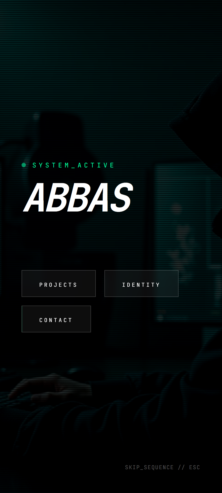
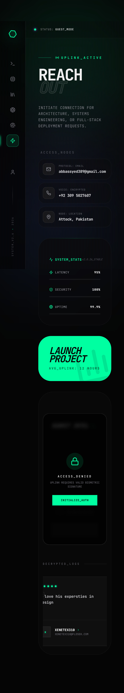
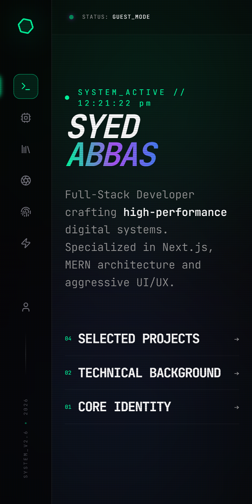

# Cyberpunk Portfolio - Syed Abbas


<!--  -->

> A futuristic full-stack developer portfolio with immersive UI, animated interactions, and integrated Supabase authentication.

This project is a personal portfolio application built with React, TypeScript, and Vite. It features a cinematic cyberpunk interface, route-based content sections, and a Supabase-powered auth page for secure sign-in.

Visit website at:

```link
Add your deployed URL here
```

## Key Features

- Cyberpunk visual system with animated side navigation, system-status HUD, and ambient effects.
- Intro flow with first-visit logic and transition into the main interface.
- Dedicated route sections for Projects, Education, Hobbies, About, and Contact.
- Project archive with live demo links, GitHub links, and one-click copy actions.
- Supabase authentication page with provider login (Google and GitHub).
- Responsive layout built with Tailwind CSS and reusable shadcn-ui components.
- Motion-first UX using Framer Motion and GSAP transitions.

---

## UI Showcase

<table>
	<tr>
		<th width="50%">Main Visual</th>
		<th width="50%">Sections Preview</th>
	</tr>
	<tr>
		<td valign="top">
			
			<p align="center"><em>Contact & Review</em></p>
		</td>
		<td>
			
			<p align="center"><em>Landing experience with cinematic identity reveal</em></p>
			
			<p align="center"><em>Section-driven storytelling</em></p>
			<!--  -->
			<!-- <p align="center"><em>Project and tooling perspective</em></p> -->
		</td>
	</tr>
</table>

---

## Tech Stack

<!-- - Framework: [React 18](https://react.dev/) -->
- Build Tool: [Vite](https://vitejs.dev/)
- Language: [TypeScript](https://www.typescriptlang.org/)
- Styling: [Tailwind CSS](https://tailwindcss.com/)
- UI Components: [shadcn-ui](https://ui.shadcn.com/) + [Radix UI](https://www.radix-ui.com/)
- Routing: [React Router](https://reactrouter.com/)
<!-- - Data Fetching: [TanStack Query](https://tanstack.com/query/latest) -->
- Auth + Backend Services: [Supabase](https://supabase.com/)
- Animations: [Framer Motion](https://www.framer.com/motion/) + [GSAP](https://gsap.com/)
- Icons: [Lucide React](https://lucide.dev/)

---

## Getting Started

Install dependencies and run the development server:

```bash
npm install
npm run dev
```

Other available scripts:

```bash
npm run build
npm run build:dev
npm run preview
npm run lint
```

The app runs by default on:

```link
http://localhost:5173
```

---

## Environment Variables

Create a `.env` file in the project root and add:

```bash
VITE_SUPABASE_URL=https://aodxp
VITE_SUPABASE_PUBLISHABLE_DEFAULT_KEY=sb_publishable_BWY

VITE_SUPABASE_ANON_KEY=eyJhbGciOiJIUzI1N

```

These values are required for the auth flow and Supabase client initialization.

---

## Project Structure (High Level)

- `src/pages`: Route entry pages (`Index`, `Auth`, `NotFound`)
- `src/components/sections`: Main portfolio content sections
- `src/components/ui`: Reusable UI primitives
- `src/assets`: Portfolio image assets used by sections 
- `src/supabaseClient.ts`: Supabase client setup via Vite env variables
